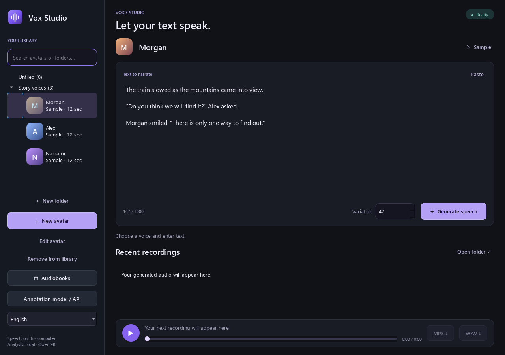
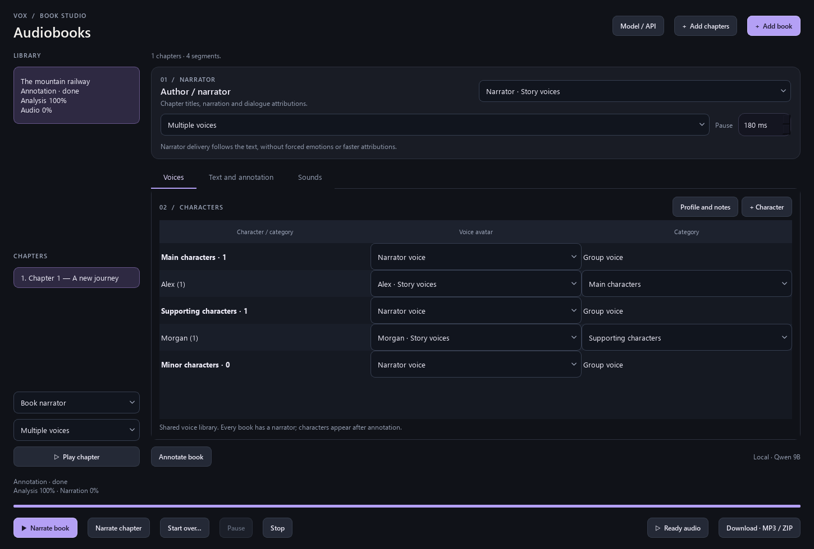
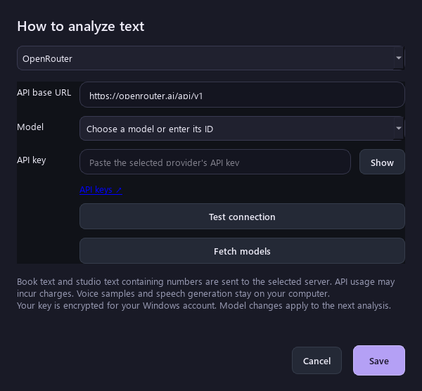

# Book Studio

**English** · [Русский](README.ru.md)

A Windows desktop studio for voice avatars, expressive speech and multi-voice audiobooks. Import a book, review its characters and narrator, assign voices, and export a chapter or the whole book. The desktop application is currently branded **Vox Studio**.

[Download Windows setup](../../releases/latest) · [Installation & models](docs/INSTALL.md) · [Third-party components](THIRD_PARTY.md)



## What it does

- Create reusable voice avatars from an audio sample or microphone recording. Organize them in folders and subfolders, and search by name or folder.
- Import PDF, DOCX, EPUB, FB2, TXT and other supported text formats. Append chapters while retaining the character registry and previous context.
- Separate narration, dialogue and sound cues. Review assignments, edit fragments, and keep character profiles and personal notes.
- Assign a voice to the narrator, a character category, an individual character, or an entire chapter. Sound cues can use uploaded audio, narrator speech, or be skipped.
- Pause and resume analysis and speech generation. Completed work is saved locally; failed API blocks use bounded, cancellable recovery.
- Export one chapter as MP3, all chapters as a ZIP, or the complete book as one MP3. Regenerate a selected chapter or the whole book.
- Choose **Русский / English** in the studio sidebar, then restart. Book text, character names and model output are not translated by the interface language setting. Some detailed engine diagnostics retain their original language.



## Local models and API providers

| Task | Default local model | Runtime |
| --- | --- | --- |
| Voice cloning and speech | **Higgs Audio v3 TTS 4B**, Q8_0 GGUF | audio.cpp v0.9.0, CUDA 12.4 |
| Book analysis, speaker/context assignment and number preparation | **Qwen3.5 9B**, Q4_K_M GGUF | llama.cpp b11146, CUDA 12.4 |
| Reference transcription | Whisper (downloaded when needed) | PyTorch |

Model downloads are separate from the source and installer. `download_upgrade.py` specifies the exact files, downloads the native runtimes and verifies model file hashes against repository metadata. Local analysis and speech run in separate workers so their large models do not need to occupy GPU memory together. The default configuration does not intentionally offload the main models to the CPU.

Book analysis can instead use **DeepSeek**, **OpenRouter**, or another **OpenAI-compatible API**. Open **Annotation model / API**, select the provider, enter its base URL and key, then load the model list or type an exact model ID. The connection check uses `/models`; it does not generate text. A successful check confirms discovery/access, not the model's ability to follow the book schema. Custom models must support streaming `/chat/completions`, JSON object output and the requested token budget.



The text pipeline is primarily tuned for **Russian books**, including number inflection and punctuation preparation. English UI support does not imply equal analysis or pronunciation quality in every language. Review important speaker assignments before rendering a long book.

## Quick start

1. Use **Windows 10/11 x64**, an NVIDIA GPU with a compatible current driver, and sufficient free disk space for dependencies and multi-gigabyte models. The development machine uses an RTX 4060 8 GB and 32 GB RAM; longer inputs are processed in bounded blocks. This is not a guarantee that every GPU/configuration fits every workload.
2. Download `BookStudio-Setup.exe` from [Releases](../../releases/latest). It contains the clean application source, not the model weights. Run it, choose the installation folder, and press Install. Installation uses the network and can take a while.
3. Setup installs an isolated Python 3.12 environment, CUDA PyTorch, application packages, native runtimes and default models, then creates a desktop shortcut. A system CUDA toolkit is not required; an NVIDIA driver is.
4. Launch the desktop shortcut, create an avatar, and try a short text. Open Audiobooks to import a book and assign the narrator and character voices.

Alternatively, extract `BookStudio-source.zip` to a writable folder and run `setup.cmd`, then `start.cmd`. Model downloads can be resumed by running setup again. Back up the installation's `data` and `outputs` folders before moving or upgrading it.

The Windows bootstrapper is unsigned, so Windows may display a publisher warning. Published SHA-256 sums let you compare downloaded artifacts with the release. No administrator installation is intentionally required.

## Privacy and project status

Books, voice references, settings and generated audio stay in local data folders and are excluded from the repository and release. API keys are encrypted with Windows DPAPI for the current Windows account. When a cloud analysis provider is selected, book text and relevant context are sent to that provider and may incur usage charges; speech synthesis remains local. Diagnostic logs can contain book text and should be reviewed before sharing.

This is an evolving desktop application. Generation may still require review; recovery is bounded rather than an endless retry loop. Use voice samples and book material you have permission to process. Third-party model and runtime terms apply separately; see [THIRD_PARTY.md](THIRD_PARTY.md). No additional license grant for the application source has been selected yet.

## Development

```powershell
# Install dependencies without model downloads or a desktop shortcut:
powershell -NoProfile -ExecutionPolicy Bypass -File setup.ps1 -SkipModels -NoShortcut
.venv\Scripts\python.exe -m unittest test_deepseek_api test_provider_ui test_model_json test_book_extensions test_avatar_folders
# Build the source ZIP and Windows bootstrapper (Windows .NET Framework compiler):
.venv\Scripts\python.exe tools\build_release.py
```

The release archive is created from the explicit `distribution.json` allowlist, not a copy of a developer's data directory. Screenshots use synthetic demonstration data.
